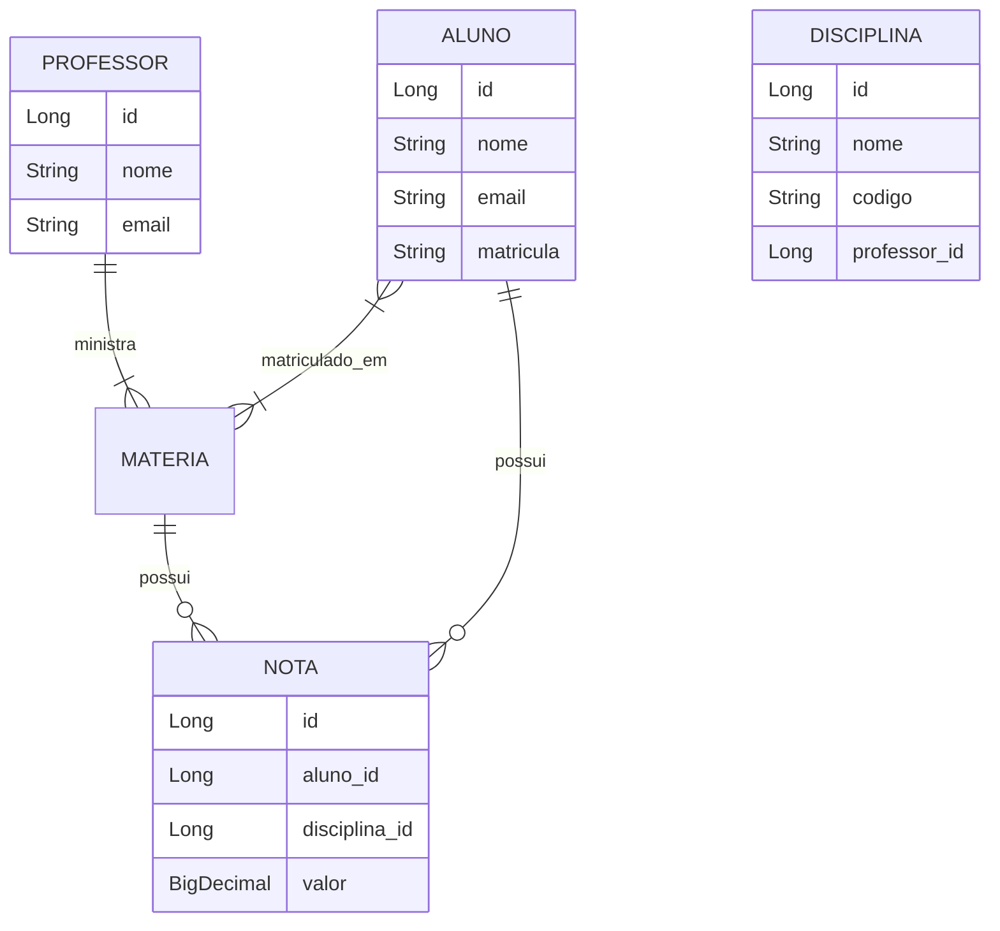

# Desafio Técnico — Sistema de Gestão Acadêmica

## Objetivo

Desenvolver uma API REST utilizando **Java e Spring Boot** para gerenciamento de alunos, professores, disciplinas e notas.

O sistema deverá implementar operações de **CRUD** e permitir o relacionamento entre alunos, disciplinas e professores, incluindo o registro das notas obtidas pelos alunos em cada disciplina.

O objetivo principal é avaliar conhecimentos de:

* Java
* Spring Boot
* Spring Data JPA
* JPA/Hibernate
* APIs REST
* Modelagem de dados e relacionamentos
* Persistência em banco de dados
* Validação de dados
* Tratamento de exceções

---

# Domínio da aplicação

O sistema será composto pelas seguintes entidades:

* **Aluno**
* **Professor**
* **Disciplina**
* **Nota**

---

# Regras de relacionamento

## Aluno × Disciplina

Um **aluno deve estar matriculado em uma ou mais disciplinas**.

Uma **disciplina deve possuir um ou mais alunos**.

Portanto, temos um relacionamento:

**N:N (Many-to-Many)**

### Cardinalidade

```text
Aluno 1..* -------- 1..* Disciplina
       N:N
```

Exemplo:

```text
Aluno: João
 ├── Java
 ├── Banco de Dados
 └── Arquitetura de Software

Aluno: Maria
 ├── Java
 └── Banco de Dados
```

Uma disciplina também pode possuir vários alunos:

```text
Matéria: Java
 ├── João
 ├── Maria
 └── Carlos
```

---

## Professor × Disciplina

Um **professor deve ministrar uma ou mais disciplina**.

Uma **disciplina deve possuir exatamente um professor**.

Portanto, temos um relacionamento:

**1:N (One-to-Many)**

### Cardinalidade

```text
Professor 1..* -------- 1 Disciplina
            1:N
```

Exemplo:

```text
Professor: Carlos
 ├── Java
 ├── Spring Boot
 └── Arquitetura de Software
```

Enquanto cada disciplina possui apenas um professor:

```text
Java
Professor responsável: Carlos
```

Uma disciplina **não pode possuir dois ou mais professores**.

---

# Aluno × Nota × Disciplina

Cada aluno deve possuir suas notas nas disciplinas em que está matriculado.

Uma nota pertence a:

* um aluno
* uma disciplina

Um aluno pode possuir várias notas e uma disciplina pode possuir várias notas, uma para cada aluno.

A entidade `Disciplina` funciona como uma entidade associativa entre **Aluno** e **Disciplina**, podendo armazenar informações relacionadas à avaliação.

### Cardinalidade

```text
Aluno 1 -------- N Nota N -------- 1 Disciplina
```

Ou, considerando o contexto da matrícula:

```text
Aluno 1..* -------- 1..* Disciplina
       |
       |
      Nota
```

A implementação deve garantir que a nota esteja associada ao aluno e à disciplina correspondentes.

---

# Modelo conceitual



---

# Entidades

## Aluno

Representa um aluno cadastrado no sistema.

Campos mínimos sugeridos:

| Campo       | Tipo   | Obrigatório |
| ----------- | ------ | ----------- |
| `id`        | Long   | Sim         |
| `nome`      | String | Sim         |
| `email`     | String | Sim         |
| `matricula` | String | Sim         |

Um aluno deve possuir uma ou mais disciplinas.

---

## Professor

Representa um professor cadastrado no sistema.

Campos mínimos sugeridos:

| Campo   | Tipo   | Obrigatório |
| ------- | ------ | ----------- |
| `id`    | Long   | Sim         |
| `nome`  | String | Sim         |
| `email` | String | Sim         |

Um professor deve possuir uma ou mais disciplinas.

---

## Disciplina

Representa uma disciplina oferecida pela instituição.

Campos mínimos sugeridos:

| Campo       | Tipo      | Obrigatório |
| ----------- | --------- | ----------- |
| `id`        | Long      | Sim         |
| `nome`      | String    | Sim         |
| `codigo`    | String    | Sim         |
| `professor` | Professor | Sim         |

Cada disciplina possui **exatamente um professor**.

Uma disciplina possui **um ou mais alunos**.

---

## Nota

Representa a nota de um aluno em uma determinada disciplina.

Campos mínimos sugeridos:

| Campo     | Tipo       | Obrigatório |
| --------- | ---------- | ----------- |
| `id`      | Long       | Sim         |
| `valor`   | BigDecimal | Sim         |
| `aluno`   | Aluno      | Sim         |
| `disciplina` | Disciplina    | Sim         |

A nota deve possuir um valor válido de acordo com a regra definida pelo desenvolvedor.

Como sugestão, pode ser utilizada uma escala de:

```text
0.0 até 10.0
```

---

# Regras de negócio

A aplicação deve respeitar as seguintes regras:

### Aluno

* Um aluno deve possuir pelo menos uma matéria.
* Um aluno pode estar matriculado em várias matérias.
* Um aluno pode possuir notas em suas matérias.

### Professor

* Um professor deve possuir pelo menos uma matéria.
* Um professor pode ministrar várias matérias.

### Disciplina

* Uma disciplina deve possuir exatamente um professor.
* Uma disciplina deve possuir pelo menos um aluno.
* Uma disciplina pode possuir vários alunos.

### Nota

* Uma nota pertence a exatamente um aluno.
* Uma nota pertence a exatamente uma disciplina.
* O aluno associado à nota deve estar matriculado na disciplina correspondente.
* O valor da nota deve estar dentro do intervalo definido pela aplicação.

---

# CRUD

A aplicação deve disponibilizar endpoints REST para realizar o CRUD das entidades.

## Alunos

```http
POST   /alunos
GET    /alunos
GET    /alunos/{id}
PUT    /alunos/{id}
DELETE /alunos/{id}
```

Exemplo de criação:

```json
{
    "nome": "João da Silva",
    "email": "joao@email.com",
    "matricula": "20260001"
}
```

---

## Professores

```http
POST   /professores
GET    /professores
GET    /professores/{id}
PUT    /professores/{id}
DELETE /professores/{id}
```

Exemplo:

```json
{
    "nome": "Carlos Souza",
    "email": "carlos@email.com"
}
```

---

## Disciplina

```http
POST   /disciplina
GET    /disciplina
GET    /disciplina/{id}
PUT    /disciplina/{id}
DELETE /disciplina/{id}
```

Exemplo:

```json
{
    "nome": "Programação Java",
    "codigo": "JAVA001",
    "professorId": 1
}
```

---

## Notas

```http
POST   /notas
GET    /notas
GET    /notas/{id}
PUT    /notas/{id}
DELETE /notas/{id}
```

Exemplo:

```json
{
    "valor": 8.5,
    "alunoId": 1,
    "materiaId": 2
}
```

---

# Funcionalidades adicionais

Além do CRUD básico, a aplicação deve disponibilizar consultas relacionadas aos relacionamentos.

Sugestões:

### Consultar disciplinas de um aluno

```http
GET /alunos/{id}/disciplinas
```

### Consultar alunos de uma matéria

```http
GET /disciplinas/{id}/alunos
```

### Consultar disciplinas de um professor

```http
GET /professores/{id}/disciplinas
```

### Consultar notas de um aluno

```http
GET /alunos/{id}/notas
```

### Consultar notas de uma matéria

```http
GET /disciplinas/{id}/notas
```

### Consultar nota de um aluno em uma disciplina

```http
GET /alunos/{alunoId}/disciplinas/{materiaId}/nota
```

---

# Persistência

As entidades devem ser persistidas utilizando **JPA/Hibernate**.

O banco de dados deve representar corretamente os relacionamentos.

Uma possível estrutura seria:

```text
ALUNO
 ├── id
 ├── nome
 ├── email
 └── matricula

PROFESSOR
 ├── id
 ├── nome
 └── email

DISCIPLINA
 ├── id
 ├── nome
 ├── codigo
 └── professor_id

ALUNO_MATERIA
 ├── aluno_id
 └── disciplina_id

NOTA
 ├── id
 ├── aluno_id
 ├── disciplina_id
 └── valor
```

O relacionamento `Aluno x Materia` deverá ser representado como **Many-to-Many**, podendo utilizar uma tabela intermediária `ALUNO_MATERIA`.

A entidade `Nota` deverá possuir referências para `Aluno` e `Materia`.

---

# Validações

A API deve realizar validações dos dados recebidos.

Exemplos:

* `nome` não pode ser vazio.
* `email` deve possuir formato válido.
* `matricula` deve ser obrigatória.
* `codigo` da matéria deve ser obrigatório.
* `valor` da nota deve estar dentro do intervalo permitido.
* Um professor informado ao cadastrar uma matéria deve existir.
* Um aluno informado ao cadastrar uma nota deve existir.
* Uma matéria informada ao cadastrar uma nota deve existir.
* Não deve ser possível cadastrar uma nota para um aluno que não esteja matriculado na matéria.

Pode ser utilizado o **Bean Validation**, por exemplo:

```java
@NotBlank
private String nome;

@Email
@NotBlank
private String email;

@NotNull
@DecimalMin("0.0")
@DecimalMax("10.0")
private BigDecimal valor;
```

---

# Tratamento de erros

A aplicação deve retornar respostas HTTP adequadas.

Exemplos:

```text
200 OK
201 CREATED
204 NO CONTENT
400 BAD REQUEST
404 NOT FOUND
409 CONFLICT
500 INTERNAL SERVER ERROR
```

Recomenda-se implementar um tratamento global de exceções utilizando:

```java
@RestControllerAdvice
```

A resposta de erro deve ser padronizada.

Exemplo:

```json
{
    "status": 404,
    "message": "Aluno não encontrado",
    "timestamp": "2026-10-02T17:30:00"
}
```

---

# Organização sugerida

Uma possível organização do projeto:

```text
src/main/java
└── br.com.desafio
    ├── controller
    │   ├── AlunoController
    │   ├── ProfessorController
    │   ├── MateriaController
    │   └── NotaController
    │
    ├── service
    │   ├── AlunoService
    │   ├── ProfessorService
    │   ├── MateriaService
    │   └── NotaService
    │
    ├── repository
    │   ├── AlunoRepository
    │   ├── ProfessorRepository
    │   ├── MateriaRepository
    │   └── NotaRepository
    │
    ├── entity
    │   ├── Aluno
    │   ├── Professor
    │   ├── Materia
    │   └── Nota
    │
    ├── dto
    │
    ├── exception
    │
    └── config
```

Essa estrutura é apenas uma sugestão. O desenvolvedor pode utilizar outra organização desde que mantenha uma separação adequada das responsabilidades.

---

# Requisitos mínimos para entrega

A solução deverá:

* Ser desenvolvida utilizando **Java + Spring Boot**.
* Implementar CRUD de **Aluno**.
* Implementar CRUD de **Professor**.
* Implementar CRUD de **Disciplina**.
* Implementar CRUD de **Nota**.
* Implementar o relacionamento **Aluno x Disciplina (N:N)**.
* Implementar o relacionamento **Professor x Disciplina (1:N)**.
* Garantir que uma Disciplina possua apenas um professor.
* Permitir que um professor possua várias Disciplina.
* Permitir que um aluno possua várias Disciplina.
* Permitir que uma Disciplina possua vários alunos.
* Associar notas aos respectivos alunos e Disciplina.
* Persistir os dados em banco de dados relacional.
* Implementar validações básicas.
* Implementar tratamento adequado de erros.
* Disponibilizar uma API REST funcional.

---

# Cardinalidades — Resumo

| Relacionamento      | Cardinalidade |
| ------------------- | ------------- |
| Aluno → Disciplina     | **1:N**       |
| Disciplina → Aluno     | **1:N**       |
| Aluno ↔ Disciplina     | **N:N**       |
| Professor → Disciplina | **1:N**       |
| Disciplina → Professor | **N:1**       |
| Aluno → Nota        | **1:N**       |
| Disciplina → Nota      | **1:N**       |
| Nota → Aluno        | **N:1**       |
| Nota → Disciplina      | **N:1**       |

### Representação simplificada

```text
                  1                 N
        ┌─────────────────────────────────┐
        │                                 │
   PROFESSOR ────────────────< DISCIPLINA │
                                  │        │
                                  │        │
                                  │ N      │
                                  │        │
                                  ▼        │
                                NOTA       │
                                  ▲        │
                                  │        │
                                  │ N      │
                                  │        │
                               ALUNO >─────┘
                                 N
```

De forma mais precisa:

```text
PROFESSOR
    1
    │
    │
    N
 DISCIPLINA
    │
    │
    N
    │
    │
   ALUNO
```

O relacionamento entre **Aluno e Disciplina** deve ser tratado como **N:N**, utilizando uma tabela intermediária.

As notas ficam vinculadas ao par:

```text
ALUNO + DISCIPLINA = NOTA
```

Assim, o sistema consegue representar, por exemplo:

```text
João
 ├── Java → 8,5
 ├── Banco de Dados → 7,0
 └── Spring Boot → 9,0

Maria
 ├── Java → 9,5
 └── Banco de Dados → 8,0
```

---
